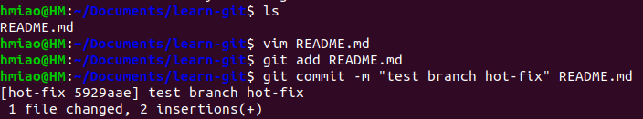

# Git memo

---
```尚硅谷GitHub基础全套完整版教程(bilibili)``` 

Git测试目录```~/Documents/learn-git```


## 代码托管中心（维护远程库）

---

### 局域网

 ```Gitlab```

### 外网

 ```Gitee```
 
 ```Github```

### 本地库与远程库

- 团队内部协作
- 跨团队协作

#### 团队内部协作

---


- 第一步，岳不群(Leader)先创建一个本地库，为了能把本地库内容推送到代码托管中心，需要建立远程库，并把本地工作push到远程库；
- 第二步，令狐冲(member)执行clone操作，把远程库的内容克隆到本地（同时初始化-创建本地库）；
- 第三步，令狐冲得到“加入团队”的批准，可以向远程库(push)提交代码；
- 第四步，岳不群执行pull操作，获取令狐冲的全新提交内容。

#### 跨团队协作

---
如果岳不群让令狐冲开发葵花宝典，令狐冲不会，令狐冲找到日月神教公司的东方不败帮忙。


- 第一步，东方不败执行fork操作，得到一个与岳不群内容一模一样，归属于东方不败的远程库；
- 第二步，东方不败clone远程库到本地，提交自己的贡献，push到自己的远程库；
- 第三步，东方不败发起pull request，经过岳不群审核通过后，岳不群merge，把东方不败的贡献合并到岳不群的远程库；
- 第四步，团队内部成员岳不群和令狐冲pull合并后远程库的内容，查看东方不败的贡献。

## Git命令行操作

---

### 本地库初始化

#### 创建本地库

- 新建文件夹```learn-git```, ```mkdir ~/Documents/learn-git```
- ```cd ~/Documnts/learn-git```, ```git init```

#### 设置签名

- 设置签名：用户名-```hongmiao```, Email: hongmiao_yan@163.com.只是用于区分不同开发人员的身份。
 这里设置的签名，与登录远程代码托管中心的帐号密码没有任何关系。下面是设置签名的命令：
- 项目|仓库级别签名：仅在当前本地库范围内有效

```git config user.name hongmiao``` 

```git config user.email hongmiao_yan@163.com```

- 系统用户级别签名：当前登录系统的用户创建的所有本地库都有效

```git config --global user.name hongmiao``` 

```git config --global user.email hongmiao_yan@163.com```

- 优先级：项目级别 > 系统用户级别（二者都有的情况下）,二者任选一个，不能一个也没有。

#### 查看状态

 ```git status```查看暂存区、工作区的状态。


```git add README.md```将文件从工作区提交到暂存区。


```git commit -m "your message" README.md```将暂存区的内容提交到本地库。


#### 版本穿梭（查看历史版本）

```git log```查看所有的历史提交。


```git log --pretty=oneline```在提交信息很多（一屏显示不下）时，每行显示一条提交信息。


```git log --oneline```提交信息的Hash值只显示前几位，此命令只显示当前HEAD指针及之前(before)的版本。


```git reflog```比上述命令多出一个HEAD@{N},N代表从当前分支移动到目标分支，需要移动的步数。


#### 版本前进与后退

- 基于索引值的方式（推荐）```git reset --hard hashvalue```哈希值取前几位就行```git reflog```来查看。

```git reset --hard c4ac189```


 版本会退后，```git reflog```的显示结果是：


- 基于^符号：只能后退。```git reset --hard HEAD^``` 
```git reset --hard HEAD^^^```代表后退三次。
- 基于\~符号：当回退步数太多时，当然无法用一串^^^^^去描述。```git reset --hard HEAD~3```也是后退三次。

##### git reset三种参数对比(hard|soft|mixed)

- "--soft"，仅仅在本地库移动HEAD指针；
- "--mixed"，在本地库移动HEAD指针，重置暂存区；
- "--hard"，在本地库移动HEAD指针，重置暂存区，重置工作区。
在正常情况下，工作区-暂存区-本地库三者处于同步的状态。


```git reset --soft hashvalue```仅让本地库回退，相对地突出了暂存区和工作区的位置。


这相当于，你做了新的修改，并```git add filename```**提交到暂存区**，但是没有提交到本地库，我们用```git status```查看一下。
  

```git reset --mixed hashvalue```让本地库和暂存区都后退，相对地突出了工作区。  

  

这相当于你做了新的修改，但是还**没```git add filename```提交到暂存区**。此时,```git status```查看文件状态


#### 永久删除文件后找回

---
我创建了一个文件```getback```来测试找回删除文件这一个功能。


你在工作区删除了文件```getback```


还需要```git add getback```以及```git commit -m "your message" getback```使暂存区和本地库得到删除指令。


这时，你该如何找回被删掉的```getback```呢？你只需要回退到提交```getback```的版本就行了。


##### 删除文件小结

- 前提：文件```getback```已经被提交到本地库，这时可以用Git找回被删除的文件；
- 删除操作提交到本地库，这时回退到提交```getback```的历史版本可以找回文件；
- 删除操作未提交到本地库只提交到暂存区，这是回退到HEAD可以找回文件（因为本地库里没有增加[删除]这一条操作记录，所以本地库版本还是有文件```getback```的）。

#### diff文件比较

```diff```命令默认把工作区新修改的文件与暂存区的文件进行比对。
```git diff HEAD getback```将文件与本地库中的文件进行比较。
```git diff hashvalue getback```可以将文件与历史版本的任意一个进行比较。


```git diff```不加文件名，会把当前目录下的所有文件进行比较。

#### 分支管理

当开发大型项目时，一般不会在主分支上直接进行开发，而是不同负责不同功能的工作组创建各自的分支，在所属分支上进行开发，开发完成后合并回主分支。当项目整体出现问题时，一般不会关闭服务器进行修复，而是创建```hot_fix```分支，修改bug然后合并回主分支。


#### 分支命令

---
```git branch -v```查看当前所有分支


```git branch hot-fix```创建新分支hot-fix


```git checkout hot-fix```切换到hot-fix分支


在新分支上作出修改，则新的hot-fix分支的版本将会领先于master分支

 


此时，我们想把hot-fix分支的新增内容合并到master分支，需要切换到被合并分支master，然后合并新内容分支。

```git checkout master```, ```git merge hot-fix```


#### 分支合并的冲突

如果master分支和hot-fix分支修改了统一文件的同一行（Git以文件行为单位检查文件改动，例如diff命令），那么在合并的时候就会产生冲突，因为Git不知道改保留两处内容的哪一个。
首先，在master分支上对README.md进行修改


然后在hot-fix分支上对README.md进行修改


查看日志  


把master分支合并到hot-fix分支，并看到冲突提示信息


此时我们查看hot-fix分支下文件README.md的内容


<<<HEAD符号到===之间是当前分支的内容，===到>>>是被合并分支的内容。此时你遇到冲突，你需要和相关人员进行沟通解决，这属于人工解决冲突，不再由Git负责，Git把两方内容拼到一起。

内容冲突解决后，```git add README.md```, ```git commit -m "your message"```完成合并。注意，commit时不能添加文件名，否则会报错。


### 在本地库创建远程库的别名

---
```git remote -v```查看当前有没有远程库的别名

```git remote add hello-world https://github.com/Emiya-lin/hello-world.git```添加远程库的别名为**hello-world**

完成别名的创建以后,就可以开始把本地库的内容推送到远程库了

```git push hello-world master```git push命令后面添加**远程库别名**以及**分支名称**.

### 拉取操作

```git pull hello-world master```将远程库的内容同步到本地库. 

pull操作可以拆分成fetch(取文件)和merge(合并文件)

```git fetch hello-world master```, 切换到```git checkout hello-world/master```分支上可以看到远程库拥有,而本地库没有的新内容,但是你在working tree上是开不见新内容的,因为还没有合并.此时,你下需要切换会你的主分支,然后

```git merge hello-world/master```把远程库的内容合并到本地.

### 常见问题

I got a problem about pushing some local files into github website.
The message is :

error: src refspec master does not much any.
error: failed to push some refs to "git@github ... .git"

Here is the thing: the base branch in github, has become "main"(master previously).
By the way, master-slave, these keywords has been replaced because of the campagin of Black lives matter partly.

So you shouldn't use ```git push origin master``` anymore, you should use
> git push origin main
>
> git push origin HEAD:master

以下是原回答，来自stack overflow: 


文中提到[git-push repspec](https://git-scm.com/docs/git-push#git-push-ltrefspecgt82308203)
